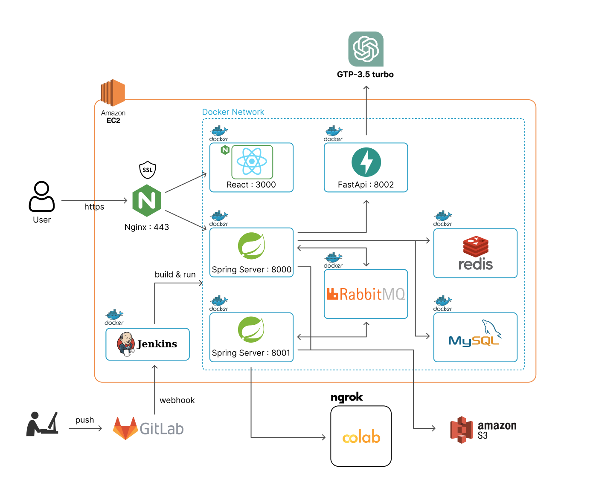
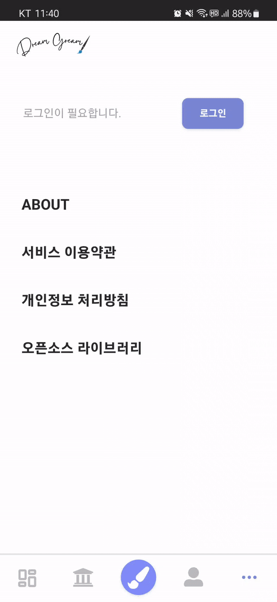
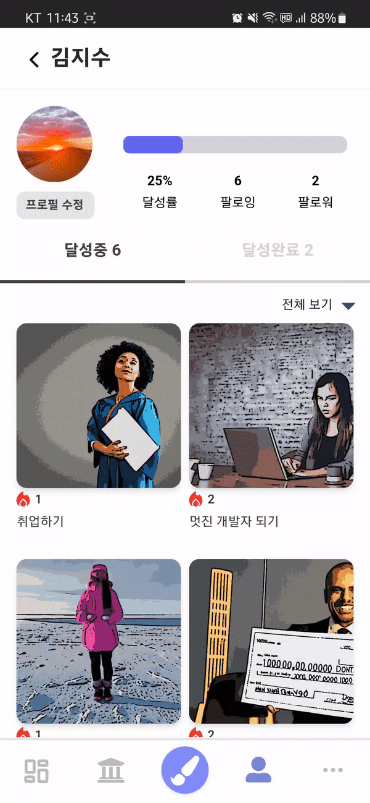

# About Dream Gream

---

- Draw Your Dream with AI
  AI로 그리는 버킷리스트 Dream Gream 🖌
- 개발 기간: 2023.07.10~2023.08.18

## Overview

---

- 막연하게 꿈만 꾸던 버킷리스트를 시각화 하여 그 꿈에 다가가는 것을 돕습니다.
- 자신의 버킷리스트를 보관하고 간직하기 어려웠던 문제를 피드에 모음으로써 해결합니다.
- 버킷리스트를 홀로 간직하는 것이 아니라 타인과의 네트워킹을 통해 동기부여 받을 수 있습니다.

## Description

---

- 드림그림은 사용자에게 ‘재미’ 와 ’소통’의 가치를 주고싶은 목표로 만들어진 서비스입니다.
- 사용자가 자신의 버킷리스트를 입력하면, 이 정보는 생성형AI를 통해 그림으로 만들어집니다.
- 사용자는 자신만의 버킷리스트 그림을 피드에 올리고, 저장할 수 있습니다.
- 버킷리스트를 달성하게 되면 달성완료 버튼을 누르고, 본인의 실제 달성사진을 업로드해 그림과 함께 간직할 수 있습니다.
- 다른사람의 버킷리스트를 공유하고, 응원해주고, 축하해주면서 소셜 네트워킹이 가능합니다.

## Main Features

---

### AI

1. Stable Diffusion 사용
   - autocast를 활용해 이미지 생성 시간 단축: 장당 8초 → 3초
2. GPT API 사용
   - GPT API를 활용하여 이미지 생성 프롬프트 최적화
3. 필터 적용
   - AI 이미지 보정 효과를 위해 openCV 활용

### FE

1. 무한 스크롤
   - React Query를 이용한 No-Offset 방식 무한 스크롤 구현
2. SSE 통신
   - 서버와 SSE통신으로 실시간으로 데이터 응답을 받음
3. Axios Interceptor
   - axios 요청보낼때 헤더에 토큰 자동첨부 및 토큰 만료시 reissue

### BE

1. Rabbit MQ
   - Rabbit MQ를 활용해 이미지 생성 요청/응답 큐를 나눠 이미지 생성 서버 부하 제어
2. Redis로 빠른 데이터 접근 및 효율성 증대
   - BEST 게시글 조회 속도 감축 : 48ms → 6ms
   - 좋아요 데이터 읽기/쓰기
3. Spring Security, OAuth2, JWT로 회원 인증/인가 기능 구현
4. 무한 스크롤
   - Query DSL을 이용한 No-Offset 방식 무한 스크롤 구현

### INFRA

### 프로젝트 아키텍처

## Screens

---

### 회원가입/로그인/프로필

- 카카오 소셜로그인
- 최초 회원 가입 시 성별/나이 입력

- 프로필 이미지 등록

### 포스팅 등록

- 카테고리 선택 및 버킷리스트 입력
- 꿈을 향한 다짐, 목표시기, 공개여부 선택
- 로딩, 이미지 도착, 피드 올리기

### 달성완료 등록

- 달성완료 등록
  - 본인 사진 등록, 달성완료 소감 등록
  - 이걸해냄 도장 지급

### 마이피드

- 카테고리 선택 및 달성 여부 탭 선택

### 팔로우/친구찾기

- 팔로우 및 팔로잉, 팔로워 탭 선택
- 닉네임 검색을 통한 친구 찾기

### 전체피드

- 응원해요피드
  - 카테고리별 조회 및 베스트 버킷리스트 조회
  - 응원해요(좋아요) 기능
  - 나도할래(스크랩) 기능

- 축하해요피드
  - 카테고리별 조회 및 베스트 버킷리스트 조회
  - 축하해요(좋아요) 기능
  - 나도할래(스크랩) 기능

### 공유하기

- 이미지 저장

- 카카오 공유 API 사용

- url 공유

---

## Service ENV

---

- node 18.15.0v
- Java 11
- Spring Boot 2.7.13
- Python 3.10
- FastAPI 0.100.0
- MySQL 8.1
- Redis 7.0.12
- Ubuntu 20.04 LTS
- Chatgpt3.5-api
- Stable diffusion v2-api

## Tools

---

- Gitlab
  - git-flow 전략으로 branch 관리
  - 코드 버전 관리
  - 자동배포 (BE-develop to master)
- JIRA
  - 매주 총 40시간의 Sprint를 진행하며 스케줄 관리
- Notion
  - 회의록 보관
  - 스프린트 회고 진행
  - 컨벤션 정리
  - 기술 이슈 정리
  - 산출물 및 공통 문서 관리
- Figma
  - 와이어프레임 및 디자인

## Stacks

---

### FE

### BE

### INFRA

## Project Outputs

---

- [기능명세서](https://docs.google.com/spreadsheets/d/1hSQxz9xcMZUKyNf-t6OM-5w9GZataRg_IBM1K6K1zDo/edit#gid=202236398)
- [WBS](https://docs.google.com/spreadsheets/d/1LschveFKhA1YkkMzVmkjLK0wTwZ_OKCX4mUPU53BNs0/edit#gid=0)
- [Notion](https://www.notion.so/_A609-b5cb58766173436485f3d0469f59880b?pvs=21)
- [WireFrame & Design](https://www.figma.com/file/5dLrdcNUMg1AgGSjWIHWkp/%EC%99%80%EC%9D%B4%EC%96%B4%ED%94%84%EB%A0%88%EC%9E%84-%EB%B0%8F-%EB%94%94%EC%9E%90%EC%9D%B8?type=design&node-id=0-1&mode=design)

## Members

---

- [박승휘](https://github.com/hwi29)(FE)
- [최홍준](https://github.com/HBumzz)(FE)
- [송준우](https://github.com/junwson9)(FE)
- [김정락](https://github.com/jlal1226)(BE)
- [김준현](https://github.com/jhhhhhj)(BE)
- [김지수](https://github.com/jis002)(BE)
