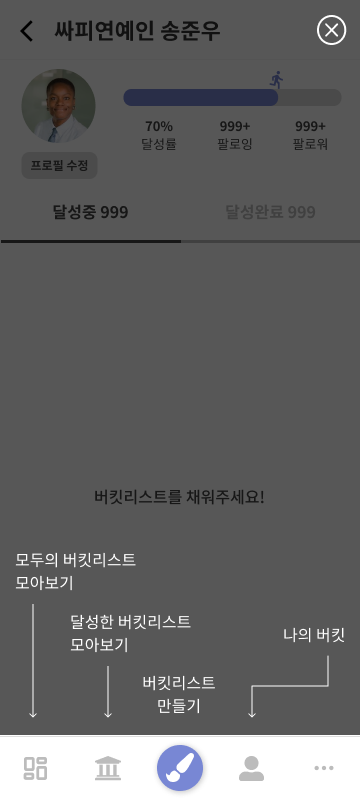

# 시연 시나리오

  
## 메뉴 소개

좌 → 우 

- 모두의 버킷리스트 모아보기 : 회원 모두가 달성중인 버킷리스트 피드
- 달성한 버킷리스트 모아보기 : 회원 모두가 달성완료한 버킷리스트 피드
- 버킷리스트 만들기 : 버킷리스트 이미지 생성 후 등록하는 메뉴
- 나의 버킷(개인피드) : 나의 버킷리스트를 확인할 수 있는 마이페이지
- 더보기 : 로그인 상태, 서비스 소개 등

  

## 1. 회원가입/로그인

- 더보기 > 로그인 클릭 시 카카오 소셜로그인 가능
- 최초 회원가입 시 연령, 나이 입력 요청

    

## 2. 개인피드

### 2-1. 개인별 버킷리스트 확인 가능

- 달성중, 달성완료 탭 별로 분리하여 조회 가능
- 카테고리별로 분리하여 조회 가능

### 2-2. 회원정보 수정

- 프로필 이미지 변경 가능
- 닉네임, 성별, 나이 변경 가능

### 2-3. 팔로우 기능

- 개인피드에서 팔로잉, 팔로워 수 클릭 시 리스트 확인 가능
- 친구찾기 : 닉네임으로 친구 검색 가능

  

## 3. 버킷리스트 생성 및 등록

- step1 : 카테고리 선택 및 버킷리스트 입력 후 [다음] 클릭
- step2 : 꿈을 향한 다짐, 목표 시기, 공개 여부 입력 후 [다음] 클릭
- step3 : 이미지 생성 로딩 화면 (타인의 버킷리스트 관람 가능)
- step4 : 생성된 이미지 확인 후 [피드올리기] 클릭 시 게시글 등록 완료

   

## 4. 버킷리스트 달성 완료 하기

- 버킷리스트 상세 페이지에서 버킷리스트 달성 완료 처리 가능
- 달성 소감, 달성일, 직접 찍인 사진 등록 후 [완료] 클릭 시 달성완료 처리됨
- “이걸해냄” 기념 도장 확인 가능

  

## 5. 달성중 버킷리스트 전체피드

- 네비게이션 가장 왼쪽 버튼 클릭하여 메뉴 접근
- 카테고리별 Best 게시글, 최신 게시글 확인 가능
- 타인의 버킷리스트 “응원해요” 가능
- 타인의 버킷리스트 “나도할래” 클릭 시 내 버킷에 스크랩됨

  

## 6. 달성완료 버킷리스트 전체피드

- 네비게이션 좌측에서 두번째 버튼 클릭하여 메뉴 접근
- 카테고리별 Best 게시글, 최신 게시글 확인 가능
- 타인의 버킷리스트 “축하해요” 가능

  

## 7. 버킷리스트 상세보기

### 7-1. 공유하기 > 이미지 다운로드

- step1: 버킷리스트 상세페이지에서 우측 상단의 more(…) 버튼 클릭
- step2: [공유하기] 클릭
- step3: [이미지 다운로드] 클릭 시 내 디바이스에 공유용 이미지 파일 저장됨

### 7-2. 공유하기 > 카카오 공유하기(카카오 공유 API)

- tep1: 버킷리스트 상세페이지에서 우측 상단의 more(…) 버튼 클릭
- step2: [공유하기] 클릭
- step3: [카카오로 공유하기] 클릭 시 카카오톡 실행됨
- step4: 카카오 친구/채팅방 선택 시 게시글 페이지 URL 공유됨

### 7-3. 공유하기 > URL 복사

- step1: 버킷리스트 상세페이지에서 우측 상단의 more(…) 버튼 클릭
- step2: [공유하기] 클릭
- step3: [URL 복사] 클릭 후 원하는 곳에 URL 붙여넣기
- Open Graph 설정이 되어 있어 OGP를 사용하는 플랫폼에서는 예쁜 링크 썸네일 확인 가능

